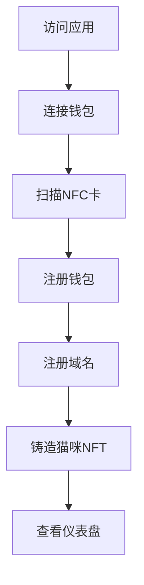

# Injective Pass - 项目总览

Injective Pass 是一个创新的 NFC 钱包解决方案，结合了物理 NFC 卡片与 Injective EVM 区块链技术，为用户提供无缝的数字身份和 NFT 体验。

## 🎯 项目愿景

创建连接物理世界的专属 Injective 数字身份，让用户能够：
- 通过物理 NFC 卡片快速获取链上身份
- 免费创建专属域名畅游 Injective 生态
- 享受云托管服务，无需牢记复杂密码

## 🏗️ 系统架构

```
┌─────────────────────────────────────────────────────────────┐
│                    Injective Pass 生态系统                    │
├─────────────────────────────────────────────────────────────┤
│                                                             │
│  ┌─────────────┐    ┌─────────────┐    ┌─────────────┐     │
│  │   前端应用   │    │   后端API   │    │ 智能合约层   │     │
│  │             │    │             │    │             │     │
│  │ • Web界面   │───▶│ • NestJS    │───▶│ • Registry  │     │
│  │ • NFC扫描   │    │ • PostgreSQL│    │ • DomainNFT │     │
│  │ • 钱包集成   │    │ • Redis缓存 │    │ • CatNFT    │     │
│  │ • NFT展示   │    │ • 加密服务  │    │ • ERC721    │     │
│  └─────────────┘    └─────────────┘    └─────────────┘     │
│                                                             │
├─────────────────────────────────────────────────────────────┤
│                    Injective EVM Testnet                   │
│        https://k8s.testnet.json-rpc.injective.network/     │
└─────────────────────────────────────────────────────────────┘
```

## 🚀 核心功能

### 1. NFC 钱包注册
- **物理绑定**: NFC 卡片与数字钱包的唯一绑定
- **安全认证**: 基于 AES-256 的加密存储
- **一键注册**: 扫描即可完成钱包创建

### 2. 域名 NFT 系统
- **`.inj` 域名**: 专属的 Injective 域名注册
- **NFT 化管理**: 域名作为 NFT 进行管理和交易
- **元数据完整**: 包含完整的域名信息和图片

### 3. 猫咪 NFT 收藏
- **7种颜色**: 黑、绿、红、橙、紫、蓝、彩虹猫
- **随机铸造**: 公平的随机分配机制
- **IPFS 存储**: 去中心化的图片存储

### 4. 完整的用户体验
- **现代化 UI**: 动态背景和流畅动画
- **多语言支持**: 中文/英文切换
- **响应式设计**: 支持各种设备尺寸

## 📊 技术栈

### 前端技术
- **HTML5**: 现代化标记语言
- **CSS3**: 动画和响应式设计
- **Vanilla JavaScript**: 原生 JavaScript，无框架依赖
- **Web NFC API**: 浏览器原生 NFC 支持

### 后端技术
- **NestJS**: 企业级 Node.js 框架
- **TypeScript**: 类型安全的开发体验
- **PostgreSQL**: 关系型数据库
- **Prisma ORM**: 现代化数据库访问层
- **Redis**: 高性能缓存系统

### 区块链技术
- **Injective EVM**: 高性能 EVM 兼容链
- **Solidity**: 智能合约开发语言
- **ethers.js**: 以太坊库集成
- **ERC-721**: NFT 标准实现

### 基础设施
- **Docker**: 容器化部署
- **Nginx**: 反向代理和负载均衡
- **IPFS**: 去中心化文件存储

## 🎨 NFT 资产

### 域名 NFT
```json
{
  "name": "alice.inj",
  "description": "Injective Domain NFT for alice",
  "image": "https://tan-academic-booby-265.mypinata.cloud/ipfs/QmSKhPCqxqJk8XgLeTvCNBbbE3n3wqZUb6xJfkGr4A3Hxs/fir.png",
  "attributes": [
    {"trait_type": "Domain", "value": "alice"},
    {"trait_type": "TLD", "value": ".inj"},
    {"trait_type": "Length", "value": 5},
    {"trait_type": "Registration Date", "value": "2025-07-27"}
  ]
}
```

### 猫咪 NFT
```json
{
  "name": "InjCat #123",
  "description": "A unique cat NFT for Injective Pass holder",
  "image": "https://tan-academic-booby-265.mypinata.cloud/ipfs/QmPNjcjhkZCBdqcUzqCfcP5Mj3HdmZzZs9uEHfhV4qsJ8m/cat_black.png",
  "attributes": [
    {"trait_type": "Color", "value": "Black"},
    {"trait_type": "Rarity", "value": "Common"},
    {"trait_type": "Generation", "value": 1}
  ]
}
```

## 🔧 部署架构

### 生产环境
```yaml
services:
  nginx:
    image: nginx:alpine
    ports: ["8001:80", "8443:443"]
    
  api:
    build: ./nfc-wallet-backend
    ports: ["8080:3000"]
    environment:
      - NODE_ENV=production
      - DATABASE_URL=postgresql://...
      
  postgres:
    image: postgres:15-alpine
    ports: ["5432:5432"]
    volumes: [postgres_data:/var/lib/postgresql/data]
    
  redis:
    image: redis:7-alpine
    ports: ["6379:6379"]
```

### 开发环境
```bash
# 后端开发
cd nfc-wallet-backend
npm run start:dev

# 前端开发  
cd front-end
python3 -m http.server 3000
```

## 📡 API 概览

### 核心端点
| 端点 | 方法 | 功能 | 认证 |
|------|------|------|------|
| `/api/nfc/register` | POST | NFC 钱包注册 | ❌ |
| `/api/nfc/register-domain` | POST | 域名注册 | ❌ |
| `/api/nfc/draw-cat` | POST | 猫咪 NFT 铸造 | ❌ |
| `/api/nfc/stats` | GET | 系统统计 | ❌ |
| `/api/nfc/user-nfts/{address}` | GET | 用户 NFT 列表 | ❌ |

### 数据流
```
前端请求 → Nginx代理 → API服务 → 数据库/区块链 → 响应返回
```

## 🎮 用户流程

### 完整注册流程


### 详细步骤
1. **欢迎界面**: 展示产品特性和价值主张
2. **钱包选择**: 支持 MetaMask、TokenPocket 等
3. **NFC 扫描**: 物理卡片与数字身份绑定
4. **域名注册**: 创建专属 `.inj` 域名
5. **NFT 铸造**: 获得独特的猫咪 NFT
6. **仪表盘**: 管理资产和查看收藏

## 🔒 安全设计

### 数据安全
- **AES-256 加密**: 敏感数据加密存储
- **JWT 认证**: 安全的用户会话管理
- **输入验证**: 全面的数据验证和清理

### 区块链安全
- **私钥管理**: 安全的私钥存储和使用
- **交易验证**: 完整的交易数据验证
- **权限控制**: 基于角色的访问控制

### 系统安全
- **HTTPS 强制**: 生产环境强制 HTTPS
- **CORS 配置**: 严格的跨域资源共享
- **容器安全**: Docker 容器安全配置

## 📈 性能指标

### 系统性能
- **API 响应时间**: < 200ms (95th percentile)
- **NFT 铸造时间**: < 30s (包含区块链确认)
- **页面加载时间**: < 3s (首次加载)
- **数据库查询**: < 100ms (平均响应)

### 可扩展性
- **并发用户**: 支持 1000+ 同时在线用户
- **交易吞吐**: 100+ TPS (受区块链限制)
- **存储容量**: 可扩展到 TB 级别
- **缓存效率**: 95%+ 缓存命中率

## 🚀 路线图

### 第一阶段 (已完成)
- ✅ 基础架构搭建
- ✅ 智能合约部署
- ✅ NFC 钱包注册
- ✅ 域名 NFT 系统
- ✅ 猫咪 NFT 收藏
- ✅ 前端用户界面
- ✅ Docker 容器化

### 第二阶段 (规划中)
- 🔄 移动端应用
- 🔄 社交功能集成
- 🔄 NFT 交易市场
- 🔄 更多 NFT 类型
- 🔄 治理代币机制

### 第三阶段 (未来)
- 📋 多链支持
- 📋 DeFi 集成
- 📋 DAO 治理
- 📋 企业级功能
- 📋 开放 API 平台

## 🛠️ 开发指南

### 环境搭建
```bash
# 克隆项目
git clone <repository-url>
cd injective-pass

# 后端环境
cd nfc-wallet-backend
npm install
docker compose up -d postgres redis
npx prisma generate
npm run start:dev

# 前端环境
cd ../front-end
python3 -m http.server 3000
```

### 项目结构
```
injective-pass/
├── nfc-wallet-backend/     # 后端服务
│   ├── src/               # 源代码
│   ├── prisma/            # 数据库模式
│   ├── docker-compose.yml # 服务编排
│   └── README.md          # 后端文档
├── front-end/             # 前端应用
│   ├── index.html         # 主页面
│   ├── app.js            # 应用逻辑
│   ├── styles.css        # 样式文件
│   └── README.md         # 前端文档
├── foundry-inj/          # 智能合约
│   ├── src/              # 合约源码
│   └── test/             # 合约测试
└── README.md             # 项目总览
```

## 📞 支持和贡献

### 获取支持
- 📖 查看详细文档
- 🐛 提交 Issue 报告问题
- 💬 加入社区讨论
- 📧 联系开发团队

### 贡献指南
1. Fork 项目仓库
2. 创建功能分支
3. 提交代码变更
4. 创建 Pull Request
5. 代码审查和合并

### 开发团队
- **核心开发**: Injective Pass Labs
- **智能合约**: Solidity 专家团队
- **前端设计**: UI/UX 设计师
- **后端架构**: 全栈工程师

---

**项目状态**: 生产就绪 ✅  
**当前版本**: v1.0.0  
**最后更新**: 2025年7月27日  
**许可证**: MIT  

---

*Injective Pass - 连接物理与数字世界的桥梁* 🌉
