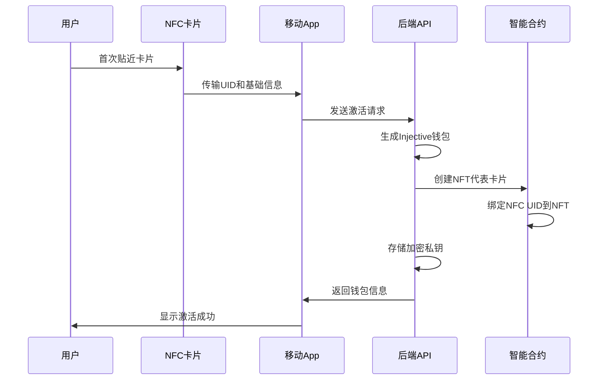
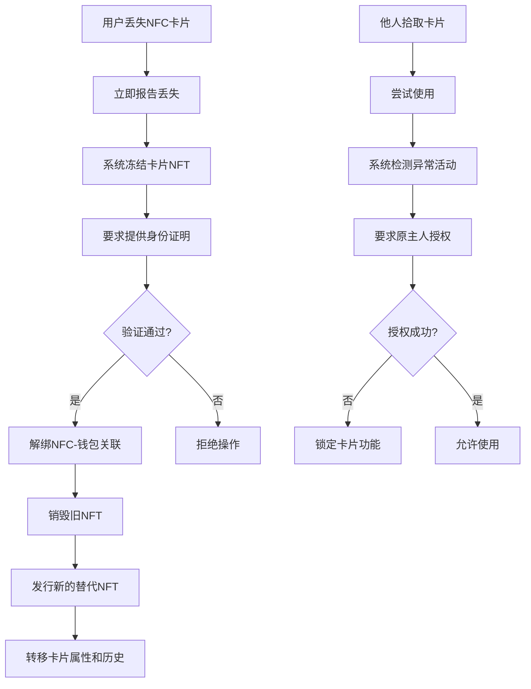
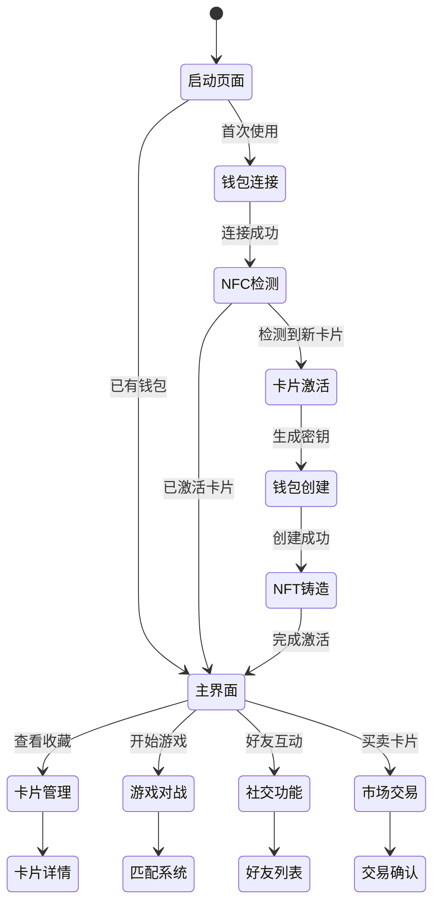

# Injective NFC钱包社交游戏系统 - 完整设计文档

## 🎯 项目愿景

基于Injective区块链构建一个革新性的NFC卡片社交游戏生态系统，将真实世界资产(RWA)、社交互动、游戏机制与去中心化金融(DeFi)完美融合。用户通过NFC卡片享受类似宝可梦卡牌游戏的体验，同时参与区块链经济活动。

---

## 🏗️ 系统架构概览

### 核心组件架构
```
┌─────────────────────────────────────────────────────────────────┐
│                    用户交互层                                      │
├─────────────────┬─────────────────┬─────────────────┬─────────────┤
│   移动端App     │   NFC硬件卡片    │   Web控制台     │   游戏界面   │
└─────────────────┴─────────────────┴─────────────────┴─────────────┘
                                │
┌─────────────────────────────────────────────────────────────────┐
│                    API网关层                                       │
├─────────────────┬─────────────────┬─────────────────┬─────────────┤
│   NFC管理API    │   用户管理API    │   游戏API       │   NFT API   │
└─────────────────┴─────────────────┴─────────────────┴─────────────┘
                                │
┌─────────────────────────────────────────────────────────────────┐
│                    业务逻辑层                                      │
├─────────────────┬─────────────────┬─────────────────┬─────────────┤
│   钱包服务      │   域名服务      │   游戏引擎      │   社交系统   │
└─────────────────┴─────────────────┴─────────────────┴─────────────┘
                                │
┌─────────────────────────────────────────────────────────────────┐
│                    数据持久层                                      │
├─────────────────┬─────────────────┬─────────────────┬─────────────┤
│   PostgreSQL    │   Redis缓存     │   IPFS存储      │   链上数据   │
└─────────────────┴─────────────────┴─────────────────┴─────────────┘
                                │
┌─────────────────────────────────────────────────────────────────┐
│                    区块链层                                        │
├─────────────────┬─────────────────┬─────────────────┬─────────────┤
│   域名注册合约   │   NFC NFT合约   │   游戏逻辑合约   │  Injective网络│
└─────────────────┴─────────────────┴─────────────────┴─────────────┘
```

---

## 💳 NFC卡片系统设计

### 1. 卡片物理特性
- **芯片类型**: NFC Type A (ISO14443A)
- **存储容量**: 8KB EEPROM
- **通信频率**: 13.56 MHz
- **读取距离**: 2-4cm
- **卡片材质**: PVC/PET，防水防磁
- **视觉设计**: 个性化艺术图案，类似Pokemon卡牌

### 2. 卡片数据结构
```typescript
interface NFCCardData {
    uid: string;                    // 唯一标识符 (32字节)
    cardType: 'normal' | 'rare' | 'legendary';  // 卡片稀有度
    generation: number;             // 发行批次
    seriesId: string;               // 系列标识
    artwork: string;                // 艺术作品标识
    metadata: {
        name: string;               // 卡片名称
        description: string;        // 描述
        stats: {                    // 游戏属性
            attack: number;
            defense: number;
            speed: number;
            rarity: number;
        };
        traits: string[];           // 特性标签
    };
}
```

### 3. 卡片生命周期管理

#### 3.1 卡片制造与分发
```solidity
// NFCCardFactory.sol
contract NFCCardFactory is Ownable {
    struct CardTemplate {
        string seriesId;
        string artwork;
        uint256 maxSupply;
        uint256 currentSupply;
        uint256 mintPrice;
        bool isActive;
    }
    
    mapping(string => CardTemplate) public cardTemplates;
    mapping(string => bool) public manufacturedCards;
    
    function registerCardTemplate(
        string memory seriesId,
        string memory artwork,
        uint256 maxSupply,
        uint256 mintPrice
    ) external onlyOwner;
    
    function authorizeCardManufacture(
        string memory nfcUID,
        string memory seriesId
    ) external onlyManufacturer;
}
```

#### 3.2 首次激活流程


---

## 🎮 社交游戏机制

### 1. 核心游戏玩法

#### 1.1 卡片对战系统
```typescript
interface BattleSystem {
    // 对战模式
    modes: {
        quickBattle: {           // 快速对战
            duration: 30,        // 30秒
            participants: 2,
            stakes: 'points'
        },
        tournament: {            // 锦标赛
            duration: 1800,      // 30分钟
            participants: 8,
            stakes: 'tokens'
        },
        guild_war: {             // 公会战
            duration: 7200,      // 2小时
            participants: 50,
            stakes: 'nft_rewards'
        }
    };
    
    // 对战机制
    mechanics: {
        cardPower: (card: NFCCard) => number;
        elementAdvantage: (type1: string, type2: string) => number;
        playerSkill: (player: Player) => number;
        randomFactor: () => number;
    };
}
```

#### 1.2 社交互动功能
```typescript
interface SocialFeatures {
    // 好友系统
    friends: {
        addFriend: (nfcUID: string) => Promise<boolean>;
        battleFriend: (friendId: string) => Promise<BattleSession>;
        shareCard: (cardId: string, friendId: string) => Promise<void>;
        viewFriendCollection: (friendId: string) => Promise<NFCCard[]>;
    };
    
    // 集卡活动
    collection: {
        tradingPost: TradingPost;           // 交易所
        auctionHouse: AuctionHouse;         // 拍卖行
        craftingSystem: CraftingSystem;     // 合成系统
        questSystem: QuestSystem;           // 任务系统
    };
    
    // 公会系统
    guilds: {
        createGuild: (name: string) => Promise<Guild>;
        joinGuild: (guildId: string) => Promise<boolean>;
        guildBattles: GuildBattleSystem;
        guildRewards: GuildRewardSystem;
    };
}
```

### 2. 游戏经济模型

#### 2.1 代币系统
```solidity
// GameToken.sol - 游戏内代币
contract GameToken is ERC20 {
    mapping(address => uint256) public playerXP;
    mapping(address => uint256) public dailyRewards;
    
    // 代币获取方式
    function earnFromBattle(address player, uint256 amount) external onlyGameContract;
    function earnFromQuest(address player, uint256 questId) external onlyGameContract;
    function earnFromTrading(address player, uint256 amount) external onlyGameContract;
    
    // 代币消费用途
    function spendOnUpgrade(address player, uint256 amount) external onlyGameContract;
    function spendOnCrafting(address player, uint256 amount) external onlyGameContract;
    function spendOnTournament(address player, uint256 entryFee) external onlyGameContract;
}
```

#### 2.2 NFT卡片经济
```solidity
// NFCCardNFT.sol - 卡片NFT合约
contract NFCCardNFT is ERC721, ReentrancyGuard {
    struct CardNFT {
        string nfcUID;              // 对应的NFC UID
        string seriesId;            // 系列标识
        uint256 level;              // 卡片等级
        uint256 experience;         // 经验值
        uint256 battleCount;        // 对战次数
        uint256 winCount;           // 胜利次数
        bool isActive;              // 是否激活状态
        address boundWallet;        // 绑定的钱包地址
    }
    
    mapping(uint256 => CardNFT) public cardNFTs;
    mapping(string => uint256) public nfcToTokenId;
    mapping(address => uint256[]) public walletCards;
    
    // 核心功能
    function mintCardNFT(
        string memory nfcUID,
        string memory seriesId,
        address initialOwner
    ) external onlyMinter returns (uint256);
    
    function bindCardToWallet(
        uint256 tokenId,
        address wallet,
        bytes memory signature
    ) external;
    
    function unbindCard(
        uint256 tokenId,
        bytes memory ownerSignature
    ) external;
    
    // 防盗机制
    function reportLostCard(uint256 tokenId) external;
    function freezeCard(uint256 tokenId) external onlyOwner;
    function transferWithSignature(
        uint256 tokenId,
        address to,
        bytes memory signature
    ) external;
}
```

---

## 🔐 安全与防盗机制

### 1. 多层安全架构

#### 1.1 卡片-钱包绑定机制
```solidity
contract CardWalletBinding {
    struct Binding {
        address walletAddress;
        uint256 boundAt;
        bytes32 bindingHash;        // 绑定哈希
        bool isActive;
        uint256 lastActivity;
    }
    
    mapping(string => Binding) public cardBindings;
    mapping(address => string[]) public walletCards;
    
    // 绑定验证
    function verifyBinding(
        string memory nfcUID,
        address wallet,
        bytes memory signature
    ) external view returns (bool);
    
    // 紧急解绑 (需要私钥签名)
    function emergencyUnbind(
        string memory nfcUID,
        bytes memory walletSignature,
        bytes memory recoverySignature
    ) external;
}
```

#### 1.2 防盗保护流程


### 2. 智能合约安全特性

#### 2.1 访问控制
```solidity
contract AccessControl {
    mapping(address => bool) public authorizedMinters;
    mapping(address => bool) public gameContracts;
    mapping(address => uint256) public operatorLevels;
    
    modifier onlyMinter() {
        require(authorizedMinters[msg.sender], "Not authorized minter");
        _;
    }
    
    modifier onlyGameContract() {
        require(gameContracts[msg.sender], "Not game contract");
        _;
    }
    
    modifier onlyHighLevelOperator() {
        require(operatorLevels[msg.sender] >= 3, "Insufficient privilege");
        _;
    }
}
```

#### 2.2 重入攻击防护
```solidity
contract ReentrancyProtected {
    mapping(address => uint256) private _executionCounter;
    
    modifier nonReentrant() {
        _executionCounter[msg.sender]++;
        uint256 counter = _executionCounter[msg.sender];
        _;
        require(_executionCounter[msg.sender] == counter, "Reentrant call");
    }
}
```

---

## 🌍 RWA (真实世界资产) 集成

### 1. 物理卡片资产化

#### 1.1 卡片价值体系
```typescript
interface CardValuation {
    // 基础价值因子
    intrinsicValue: {
        rarity: number;              // 稀有度 (1-100)
        artwork: number;             // 艺术价值 (1-100)
        utility: number;             // 游戏实用性 (1-100)
        age: number;                 // 发行年限加成
    };
    
    // 市场价值因子
    marketValue: {
        demand: number;              // 市场需求
        liquidity: number;           // 流动性
        historicalPrice: number[];   // 历史价格
        tradingVolume: number;       // 交易量
    };
    
    // 游戏价值因子
    gameValue: {
        winRate: number;             // 胜率加成
        tournamentUse: number;       // 锦标赛使用频率
        playerRating: number;        // 持有者评级
        metaRelevance: number;       // 元游戏相关性
    };
}
```

#### 1.2 实物交付系统
```typescript
interface PhysicalDelivery {
    // 实物兑换
    redeemPhysical: {
        requestPhysicalCard: (tokenId: number) => Promise<DeliveryOrder>;
        verifyOwnership: (tokenId: number, address: string) => Promise<boolean>;
        processDelivery: (orderId: string) => Promise<TrackingInfo>;
    };
    
    // 实物验证
    verification: {
        authenticateCard: (nfcUID: string) => Promise<AuthResult>;
        registerPhysicalCard: (nfcUID: string, ownerAddress: string) => Promise<void>;
        reportCounterfeit: (nfcUID: string) => Promise<void>;
    };
}
```

### 2. 跨平台资产桥接

#### 2.1 多链兼容性
```solidity
// CrossChainBridge.sol
contract CrossChainBridge {
    mapping(uint256 => bytes32) public injToEthMapping;
    mapping(bytes32 => uint256) public ethToInjMapping;
    
    // 跨链转移
    function bridgeToEthereum(uint256 injTokenId) external;
    function bridgeFromEthereum(bytes32 ethTokenHash) external;
    
    // 状态同步
    function syncCardState(uint256 tokenId, bytes memory stateData) external;
    function verifyChainState(uint256 tokenId) external view returns (bool);
}
```

#### 2.2 外部平台集成
```typescript
interface ExternalIntegrations {
    // 传统卡牌平台
    traditionalPlatforms: {
        pokemon: PokemonTCGAPI;
        magicTheGathering: MTGArenaAPI;
        yugioh: YuGiOhDuelLinksAPI;
    };
    
    // NFT市场
    nftMarketplaces: {
        opensea: OpenSeaAPI;
        rarible: RaribleAPI;
        foundation: FoundationAPI;
    };
    
    // DeFi协议
    defiProtocols: {
        lending: AaveProtocol;          // 卡片抵押借贷
        yield: YearnProtocol;           // 收益农场
        insurance: NexusMutualProtocol; // 卡片保险
    };
}
```

---

## 📱 用户体验设计

### 1. 移动端App界面

#### 1.1 核心界面流程


#### 1.2 NFC交互体验
```typescript
interface NFCInteraction {
    // 检测模式
    detection: {
        continuous: boolean;         // 持续检测
        proximity: number;           // 检测距离
        vibration: boolean;          // 震动反馈
        sound: boolean;              // 声音提示
    };
    
    // 交互动效
    animations: {
        cardScan: 'glow' | 'pulse' | 'rotate';
        dataTransfer: 'progress' | 'wave' | 'loading';
        success: 'checkmark' | 'sparkle' | 'bounce';
        error: 'shake' | 'flash' | 'fade';
    };
    
    // 触感反馈
    haptics: {
        scanStart: 'light';
        dataReceived: 'medium';
        operationComplete: 'heavy';
        error: 'warning';
    };
}
```

### 2. 游戏界面设计

#### 2.1 对战界面布局
```css
.battle-arena {
    /* 3D战斗舞台 */
    perspective: 1000px;
    background: linear-gradient(45deg, #1a1a2e, #16213e);
    
    .player-area {
        /* 玩家区域 */
        position: relative;
        transform: rotateX(15deg);
        
        .card-slot {
            /* 卡片槽位 */
            width: 120px;
            height: 180px;
            border: 2px solid #00ffff;
            border-radius: 10px;
            box-shadow: 0 0 20px rgba(0, 255, 255, 0.5);
            
            &.active {
                animation: cardGlow 2s infinite alternate;
            }
        }
        
        .health-bar {
            /* 生命值条 */
            background: linear-gradient(90deg, #ff4444, #ffff44, #44ff44);
            transition: width 0.5s ease;
        }
        
        .action-buttons {
            /* 操作按钮 */
            display: flex;
            gap: 10px;
            
            button {
                background: rgba(0, 255, 255, 0.2);
                border: 1px solid #00ffff;
                color: #00ffff;
                padding: 10px 20px;
                border-radius: 5px;
                transition: all 0.3s ease;
                
                &:hover {
                    background: rgba(0, 255, 255, 0.4);
                    box-shadow: 0 0 15px rgba(0, 255, 255, 0.6);
                }
            }
        }
    }
}

@keyframes cardGlow {
    from { box-shadow: 0 0 20px rgba(0, 255, 255, 0.5); }
    to { box-shadow: 0 0 30px rgba(0, 255, 255, 0.8); }
}
```

#### 2.2 卡片展示效果
```typescript
interface CardVisualEffects {
    // 3D卡片翻转
    flip3D: {
        duration: 800,              // 翻转时长
        easing: 'cubic-bezier(0.25, 0.46, 0.45, 0.94)',
        perspective: 1000,          // 透视距离
    };
    
    // 稀有度光效
    rarityEffects: {
        common: 'none',
        uncommon: 'silver-glow',
        rare: 'gold-glow',
        epic: 'purple-glow',
        legendary: 'rainbow-glow'
    };
    
    // 战斗动画
    battleAnimations: {
        attack: 'slash-effect',
        defend: 'shield-effect',
        special: 'lightning-effect',
        critical: 'explosion-effect'
    };
}
```

---

## 📊 数据分析与运营

### 1. 用户行为分析

#### 1.1 关键指标监控
```typescript
interface AnalyticsMetrics {
    // 用户活跃度
    userEngagement: {
        dailyActiveUsers: number;
        weeklyActiveUsers: number;
        monthlyActiveUsers: number;
        sessionDuration: number;
        sessionFrequency: number;
    };
    
    // 游戏参与度
    gameEngagement: {
        battlesPerDay: number;
        averageBattleTime: number;
        tournamentParticipation: number;
        winRateDistribution: number[];
    };
    
    // 经济活动
    economicActivity: {
        tradingVolume: number;
        averageTradeValue: number;
        marketCapitalization: number;
        priceVolatility: number;
    };
    
    // 社交互动
    socialInteraction: {
        friendConnections: number;
        guildParticipation: number;
        messagesSent: number;
        contentShared: number;
    };
}
```

#### 1.2 运营策略优化
```typescript
interface OperationalStrategy {
    // 用户获取
    userAcquisition: {
        referralProgram: ReferralSystem;
        marketingCampaigns: MarketingAutomation;
        partnershipPrograms: PartnershipManagement;
    };
    
    // 用户留存
    userRetention: {
        dailyQuests: QuestSystem;
        loyaltyRewards: LoyaltyProgram;
        seasonalEvents: EventManagement;
    };
    
    // 收入优化
    revenueOptimization: {
        cardPackSales: PackSalesAnalytics;
        premiumFeatures: SubscriptionManagement;
        transactionFees: FeeOptimization;
    };
}
```

### 2. 市场分析系统

#### 2.1 价格发现机制
```solidity
contract PriceOracle {
    struct PriceData {
        uint256 price;
        uint256 timestamp;
        uint256 volume;
        address source;
    }
    
    mapping(uint256 => PriceData[]) public priceHistory;
    mapping(uint256 => uint256) public currentPrice;
    
    // 价格聚合
    function aggregatePrice(uint256 tokenId) external view returns (uint256);
    function getPriceHistory(uint256 tokenId, uint256 timeframe) external view returns (PriceData[] memory);
    function updatePrice(uint256 tokenId, uint256 newPrice, uint256 volume) external;
}
```

#### 2.2 流动性管理
```solidity
contract LiquidityPool {
    struct Pool {
        uint256 tokenReserve;
        uint256 ethReserve;
        uint256 totalShares;
        mapping(address => uint256) userShares;
    }
    
    mapping(uint256 => Pool) public pools;
    
    // 流动性操作
    function addLiquidity(uint256 tokenId, uint256 tokenAmount) external payable;
    function removeLiquidity(uint256 tokenId, uint256 shares) external;
    function swap(uint256 fromTokenId, uint256 toTokenId, uint256 amount) external;
}
```

---

## 🚀 技术实施路线图

### Phase 1: 基础设施建设 (4-6周)

#### Week 1-2: 智能合约开发
- [ ] 域名注册合约部署
- [ ] NFC注册合约部署
- [ ] NFT卡片合约开发
- [ ] 访问控制合约实现

#### Week 3-4: 后端API完善
- [ ] 合约集成服务
- [ ] 游戏引擎基础架构
- [ ] 用户管理系统升级
- [ ] 数据库结构优化

#### Week 5-6: 安全审计与测试
- [ ] 智能合约安全审计
- [ ] 渗透测试
- [ ] 负载测试
- [ ] 集成测试

### Phase 2: 核心功能实现 (6-8周)

#### Week 7-10: 游戏系统开发
- [ ] 对战引擎实现
- [ ] 匹配系统开发
- [ ] 技能系统设计
- [ ] 排行榜系统

#### Week 11-14: 社交功能开发
- [ ] 好友系统
- [ ] 公会系统
- [ ] 聊天系统
- [ ] 交易市场

### Phase 3: 高级功能与优化 (4-6周)

#### Week 15-18: RWA集成
- [ ] 实物卡片管理
- [ ] 跨链桥接
- [ ] DeFi协议集成
- [ ] 保险机制

#### Week 19-20: 用户体验优化
- [ ] UI/UX改进
- [ ] 性能优化
- [ ] 移动端适配
- [ ] 国际化支持

### Phase 4: 上线与运营 (2-4周)

#### Week 21-22: 测试网部署
- [ ] 内部测试
- [ ] 社区测试
- [ ] Bug修复
- [ ] 功能调优

#### Week 23-24: 主网启动
- [ ] 正式部署
- [ ] 市场推广
- [ ] 运营监控
- [ ] 社区建设

---

## 💰 商业模式与收入来源

### 1. 核心收入模式

#### 1.1 卡片销售收入
```typescript
interface CardSalesRevenue {
    // 直接销售
    directSales: {
        starterPacks: 9.99,         // 新手包
        boosterPacks: 4.99,         // 补充包
        premiumPacks: 19.99,        // 高级包
        limitedEdition: 99.99       // 限量版
    };
    
    // 二级市场分成
    marketplaceFees: {
        tradingFee: 0.025,          // 2.5%交易费
        listingFee: 0.001,          // 0.1%上架费
        successFee: 0.005           // 0.5%成交费
    };
    
    // 游戏内购买
    inGamePurchases: {
        battlePasses: 9.99,         // 战斗通行证
        premiumFeatures: 4.99,      // 高级功能
        storageUpgrade: 2.99,       // 存储升级
        customization: 1.99         // 个性化定制
    };
}
```

#### 1.2 服务订阅收入
```typescript
interface SubscriptionRevenue {
    // 会员等级
    membershipTiers: {
        basic: {
            price: 4.99,
            features: ['基础对战', '好友系统', '普通交易']
        },
        premium: {
            price: 9.99,
            features: ['锦标赛参与', '高级分析', '优先匹配', '专属卡片']
        },
        elite: {
            price: 19.99,
            features: ['VIP客服', '早期体验', '独家活动', '收藏保险']
        }
    };
    
    // 企业服务
    enterpriseServices: {
        brandPartnerships: 10000,   // 品牌合作
        customDevelopment: 50000,   // 定制开发
        whiteLabel: 25000          // 白标服务
    };
}
```

### 2. 创新收入模式

#### 2.1 DeFi收益分享
```solidity
contract RevenueSharing {
    mapping(address => uint256) public stakingRewards;
    mapping(uint256 => uint256) public cardYield;
    
    // 质押挖矿
    function stakeCards(uint256[] memory tokenIds) external;
    function unstakeCards(uint256[] memory tokenIds) external;
    function claimRewards() external;
    
    // 收益分配
    function distributeRevenue(uint256 totalRevenue) external onlyOwner;
    function calculateCardYield(uint256 tokenId) external view returns (uint256);
}
```

#### 2.2 数据货币化
```typescript
interface DataMonetization {
    // 匿名化数据销售
    dataProducts: {
        marketTrends: 'gaming_analytics_package',
        userBehavior: 'engagement_insights_report',
        economicMetrics: 'tokenomics_analysis_suite'
    };
    
    // API服务
    apiServices: {
        cardPriceAPI: 0.01,         // 每次调用
        marketDataAPI: 0.05,        // 每次调用
        analyticsAPI: 0.10          // 每次调用
    };
    
    // 研究合作
    researchPartnerships: {
        academicInstitutions: 5000, // 学术机构
        marketResearchFirms: 15000, // 市场研究
        gameStudios: 25000          // 游戏工作室
    };
}
```

---

## 🎯 未来发展规划

### 1. 技术演进路径

#### 1.1 AR/VR集成
```typescript
interface ARVRIntegration {
    // 增强现实
    augmentedReality: {
        cardVisualization: '3D卡片投影',
        battleSimulation: '空间对战场景',
        collectionDisplay: '虚拟展示柜',
        socialInteraction: 'AR好友互动'
    };
    
    // 虚拟现实
    virtualReality: {
        immersiveBattles: '沉浸式对战体验',
        virtualTournaments: '虚拟竞技场',
        socialSpaces: '虚拟聚会空间',
        collectibleShowcase: '3D收藏展示'
    };
}
```

#### 1.2 AI增强功能
```typescript
interface AIEnhancement {
    // 智能匹配
    intelligentMatching: {
        skillBasedMatching: 'AI技能评估匹配',
        playStyleAnalysis: '游戏风格分析',
        balanceOptimization: '平衡性优化',
        cheatDetection: 'AI作弊检测'
    };
    
    // 个性化推荐
    personalization: {
        cardRecommendations: 'AI卡片推荐',
        strategyAdvice: '策略建议系统',
        marketInsights: '市场洞察分析',
        friendSuggestions: '好友推荐算法'
    };
}
```

### 2. 生态扩展计划

#### 2.1 跨游戏互操作性
```typescript
interface CrossGameInteroperability {
    // 游戏联盟
    gameAlliance: {
        partnerGames: Game[],
        assetSharing: 'NFT跨游戏使用',
        rewardSync: '奖励系统同步',
        leaderboards: '跨游戏排行榜'
    };
    
    // 元宇宙集成
    metaverseIntegration: {
        landOwnership: '虚拟土地所有权',
        avatarCustomization: '头像个性化',
        virtualStores: '虚拟商店',
        eventHosting: '活动举办'
    };
}
```

#### 2.2 全球化拓展
```typescript
interface GlobalExpansion {
    // 地区适配
    localization: {
        languages: ['中文', '英文', '日文', '韩文', '西班牙文'],
        currencies: ['USD', 'CNY', 'JPY', 'EUR', 'KRW'],
        regulations: '各地区合规适配',
        partnerships: '本地化合作伙伴'
    };
    
    // 文化定制
    culturalCustomization: {
        artStyles: '本地艺术风格',
        gameplayMods: '地区玩法变体',
        narratives: '本地化故事线',
        events: '文化节庆活动'
    };
}
```

---

## 📝 结论

本设计文档展示了一个雄心勃勃但可实现的愿景：将NFC技术、区块链、游戏机制和社交功能完美融合，创造一个真正创新的数字-物理混合体验。通过分阶段实施和持续优化，这个系统有潜力成为下一代社交游戏和数字收藏品的标杆。

### 核心优势
1. **技术创新**: NFC + 区块链的独特结合
2. **用户体验**: 直观的物理交互方式
3. **经济价值**: 真实世界资产的数字化
4. **社交属性**: 基于物理卡片的社交网络
5. **可扩展性**: 支持多种游戏模式和应用场景

### 成功关键要素
1. **安全可靠**: 多层次的安全防护机制
2. **用户友好**: 简单直观的操作体验
3. **经济平衡**: 公平合理的游戏经济系统
4. **社区驱动**: 强大的用户社区和生态系统
5. **持续创新**: 不断的技术更新和功能扩展

这个系统不仅仅是一个游戏，更是一个连接物理世界和数字世界的桥梁，为用户创造真正有价值和有意义的体验。 